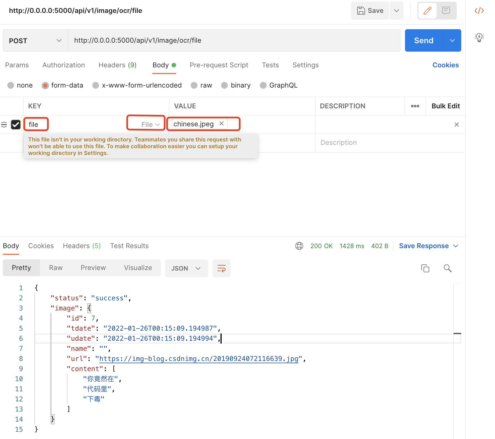

# 文档

## 数据库设计

### 图片

| 字段名  |   类型   | 是否为 null |   描述   |
| :-----: | :------: | :---------: | :------: |
|   id    |   int    |     否      | 插件 id  |
|  tdate  | datetime |     否      | 创建时间 |
|  udate  | datetime |     否      | 修改时间 |
|  name   |  string  |     否      | 图片名称 |
|   url   |  string  |     否      | 图片url  |
| content |   List   |     否      |   内容   |

## 接口

### Domain

- [http://0.0.0.0:5000](http://0.0.0.0:5000)


### 图片OCR

| action | path                   | desc                        |
| :----: | ---------------------- | --------------------------- |
|  POST  | /api/v1/image/ocr      | [图片链接OCR](#图片链接OCR) |
|  POST  | /api/v1/image/ocr/file | [图片文件OCR](#图片文件OCR) |

#### 图片链接OCR

- api

```
POST /api/v1/image/ocr
```

- Payload:

| Key | Type   | Location | default | required | Desc     |
| --- | ------ | -------- | ------- | -------- | -------- |
| url | string | body     |         | true     | 图片地址 |


- Response

| Key   | Type  | Desc         |
| ----- | ----- | ------------ |
| image | Image | 图片详细信息 |


`Image`

| Key     | Type | Desc     |
| ------- | ---- | -------- |
| id      | int  | 图片id   |
| tdate   | str  | 创建时间 |
| udate   | str  | 修改时间 |
| name    | str  | 图片名称 |
| url     | str  | 图片地址 |
| content | str  | 识别内容 |


- Example

payload:

```json
{
  "url": "https://img-blog.csdnimg.cn/20190924072116639.jpg"
}
```

`success`
```json
{
    "status": "success",
    "image": {
        "id": 1,
        "tdate": "2022-01-26T00:15:09.194",
        "udate": "2022-01-26T00:15:09.194",
        "name": "",
        "url": "https://img-blog.csdnimg.cn/20190924072116639.jpg",
        "content": [
            "你竟然在",
            "代码里",
            "下毒"
        ]
    }
}
```
- curl

```curl
curl --location --request POST 'http://0.0.0.0:5000/api/v1/image/ocr' \
--header 'Content-Type: application/json' \
--data-raw '{
    "url": "https://img-blog.csdnimg.cn/20190924072116639.jpg"
}'
```


#### 图片文件OCR

- api

```
POST /api/v1/image/ocr/file
```

- Payload:

| Key  | Type | Location | default | required | Desc     |
| ---- | ---- | -------- | ------- | -------- | -------- |
| file | File | Form     |         | true     | 图片文件 |


- Response

| Key   | Type  | Desc         |
| ----- | ----- | ------------ |
| image | Image | 图片详细信息 |


`Image`

| Key     | Type | Desc     |
| ------- | ---- | -------- |
| id      | int  | 图片id   |
| tdate   | str  | 创建时间 |
| udate   | str  | 修改时间 |
| name    | str  | 图片名称 |
| url     | str  | 图片地址 |
| content | str  | 识别内容 |


- Example

payload:


`success`
```json
{
    "status": "success",
    "image": {
        "id": 1,
        "tdate": "2022-01-26T00:15:09.194",
        "udate": "2022-01-26T00:15:09.194",
        "name": "aaa.jpg",
        "url": "",
        "content": [
            "你竟然在",
            "代码里",
            "下毒"
        ]
    }
}
```
- curl

```curl
curl --location --request POST 'http://0.0.0.0:5000/api/v1/image/ocr/file' \
--form 'file=@"<image_path>"'
```
> 在Postman中，请将 image_path 替换



